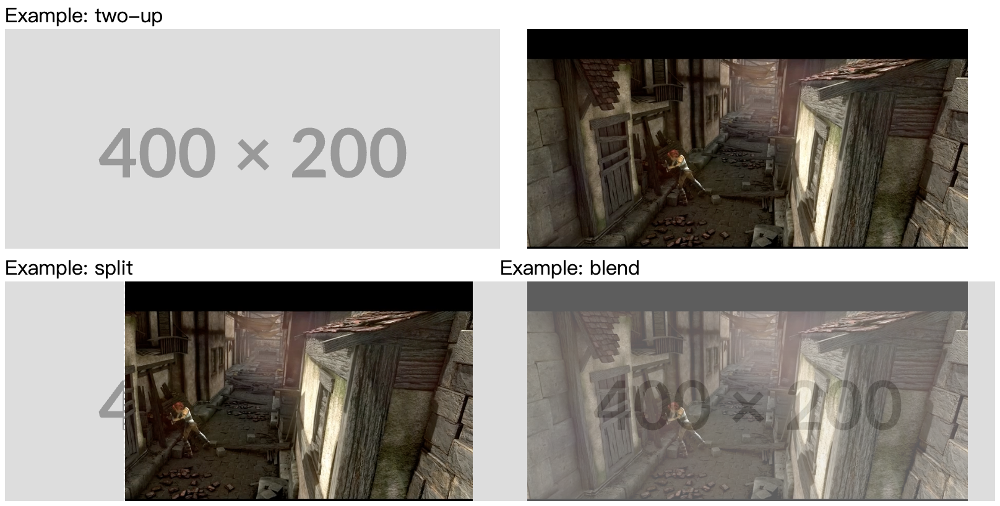

# Asserts Comparer (lit)

Create three ways to compare modified asserts(images/video/component?) between old and new. Like [this](https://gitlab.com/gitlab-org/gitlab-foss/-/issues/25824)



## How to use

```html
<script type="module" src="./asserts-comparer.mjs"></script>
<asserts-comparer mode="split">
    
    
</asserts-comparer>
```

## Mode

* 2-up (`two-up`)
* Swipe (`split`)
* Onion skin(`blend`)
